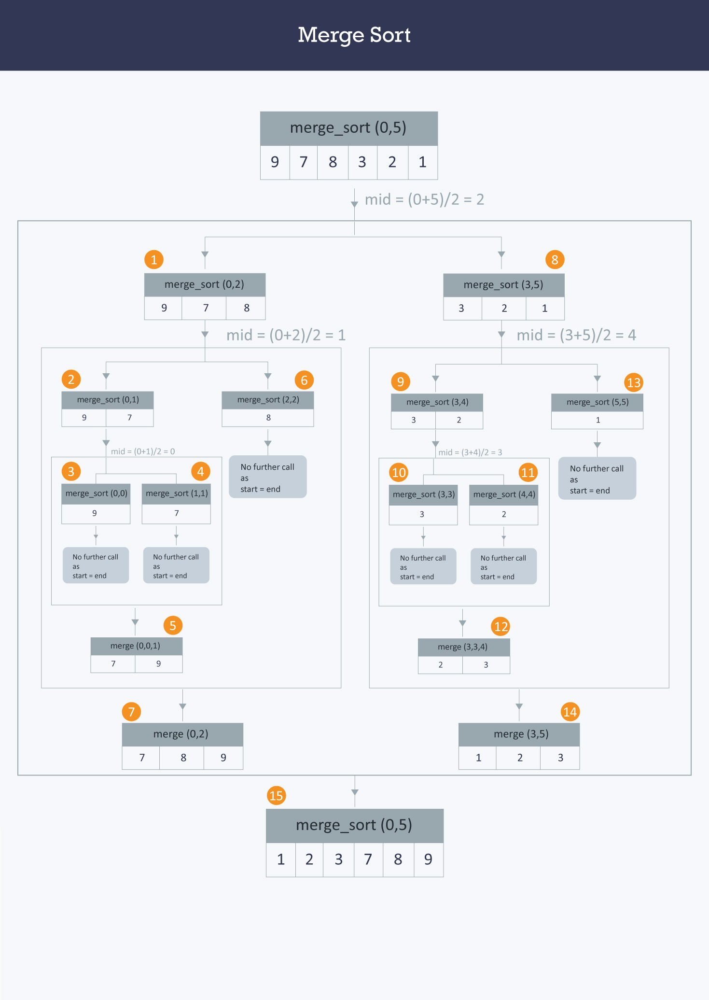

# Concepts while doing Leetcode

### Table of Contents


## Recursion and Backtracking
[Recursion and Backtracking handouts](https://www.hackerearth.com/practice/basic-programming/recursion/recursion-and-backtracking/tutorial/)

<br>
<br>

Summary 

Base case: termination condition. 

Important: 
* The problem can broken down into smaller problems of same type.
* Problem has some base case(s).
* Base case is reached before the stack size limit exceeds.

# 
<br>
<br>

## Sort
* Bubble Sort
* Insertion Sort
* Merge Sort
* Quick Sort
* Heap Sort


#### Merge Sort: 

#### Idea:
* Divide the unsorted list into N sublists, each containing 1 element.
* Take adjacent pairs of two singleton lists and merge them to form a list of 2 elements. N will now convert into N/2 lists of size 2.
* Repeat the process till a single sorted list of obtained.




#### Implementation: 

```C++
void merge(int A[ ] , int start, int mid, int end) {
 //stores the starting position of both parts in temporary variables.
int p = start ,q = mid+1;

int Arr[end-start+1] , k=0;

for(int i = start ;i <= end ;i++) {
    if(p > mid)      //checks if first part comes to an end or not .
       Arr[ k++ ] = A[ q++] ;

   else if ( q > end)   //checks if second part comes to an end or not
       Arr[ k++ ] = A[ p++ ];

   else if( A[ p ] < A[ q ])     //checks which part has smaller element.
      Arr[ k++ ] = A[ p++ ];

   else
      Arr[ k++ ] = A[ q++];
 }
  for (int p=0 ; p< k ;p ++) {
   /* Now the real array has elements in sorted manner including both parts.*/
     A[ start++ ] = Arr[ p ] ;                          
  }
}
```

Recursive Function: 
```C++
void merge_sort (int A[ ] , int start , int end )
   {
           if( start < end ) {
           int mid = (start + end ) / 2 ;           // defines the current array in 2 parts .
           merge_sort (A, start , mid ) ;                 // sort the 1st part of array .
           merge_sort (A,mid+1 , end ) ;              // sort the 2nd part of array.

         // merge the both parts by comparing elements of both the parts.
          merge(A,start , mid , end );   
   }                    
}
```
Merge Sort by using Java: https://www.baeldung.com/java-merge-sort

# Lagrange's four-square theorem
4^n(8*k+7)

https://en.wikipedia.org/wiki/Lagrange%27s_four-square_theorem

https://mathworld.wolfram.com/LagrangesFour-SquareTheorem.html


# Linked List
https://beginnersbook.com/2013/12/linkedlist-in-java-with-example/

https://www.coursera.org/learn/algorithms-part1

https://www.cs.wcupa.edu/rkline/cs3/linked-list.html

https://www.java2novice.com/data-structures-in-java/linked-list/singly-linked-list/

https://www.cs.cmu.edu/~adamchik/15-121/lectures/Linked%20Lists/linked%20lists.html

https://www.javatpoint.com/java-singly-linked-list-example


Practice: 

http://users.csc.calpoly.edu/~jdalbey/103/Demo/LinkedListExercises/

https://www.w3resource.com/java-exercises/collection/#linkedlist

http://www.cas.mcmaster.ca/~se2s03/tutorials/T10_Exercises.pdf

-> Self Test: 

https://www.cs.cmu.edu/~adamchik/15-121/lectures/Linked%20Lists/questions.html

-> Do this first: 

https://www.hackerrank.com/domains/data-structures?filters%5Bsubdomains%5D%5B%5D=linked-lists


# Backtracking 
https://www.hackerearth.com/practice/basic-programming/recursion/recursion-and-backtracking/tutorial/


# Heap
Material: 
* [Max Heap Tutorial](https://www.youtube.com/watch?v=ixdWTKWSz7s)
* [Max Heap Tutorial](https://www.youtube.com/watch?v=oAYtNV6vy-k)
* [MIT Open Course on Heap Sort](https://ocw.mit.edu/courses/electrical-engineering-and-computer-science/6-006-introduction-to-algorithms-fall-2011/lecture-videos/lecture-4-heaps-and-heap-sort/)


#### Notes: 
* Max Heap: the parent is always bigger than or equal to the child nodes 
* Min Heap: the opposite 
* If there are N nodes, then start from floor(N/2) index --> floor: ignore anything after the decimal 

