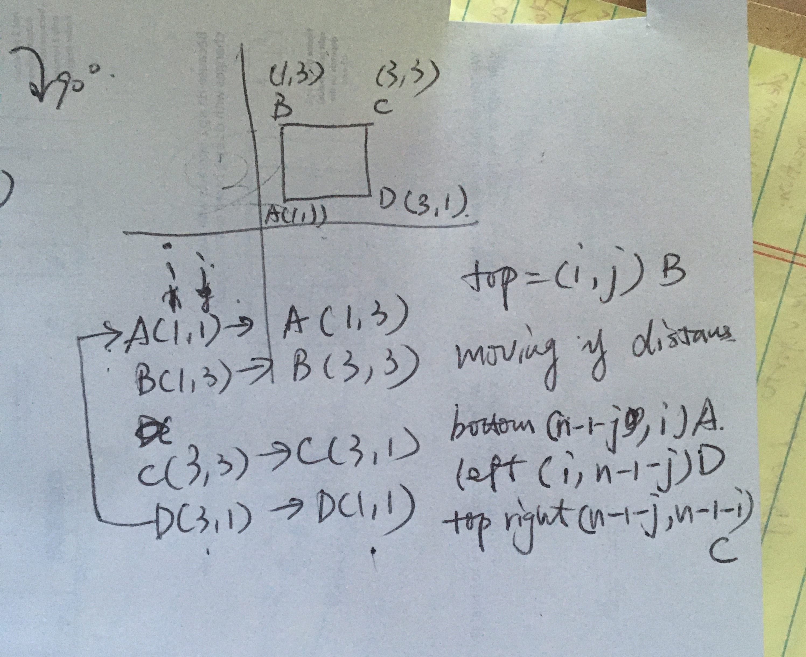

# 48. Rotate Image

https://leetcode.com/problems/rotate-image/


You are given an n x n 2D matrix representing an image.

Rotate the image by 90 degrees (clockwise).

Note:

You have to rotate the image in-place, which means you have to modify the input 2D matrix directly. DO NOT allocate another 2D matrix and do the rotation.

```
Example 1:

Given input matrix = 
[
  [1,2,3],
  [4,5,6],
  [7,8,9]
],

rotate the input matrix in-place such that it becomes:
[
  [7,4,1],
  [8,5,2],
  [9,6,3]
]
```

```
Example 2:

Given input matrix =
[
  [ 5, 1, 9,11],
  [ 2, 4, 8,10],
  [13, 3, 6, 7],
  [15, 14, 12, 16]
], 

rotate the input matrix in-place such that it becomes:
[
  [15,13, 2, 5],
  [14, 3, 4, 1],
  [12, 6, 8, 9],
  [16, 7,10,11]
]
```

### Code: 
```
class Solution {
    public void rotate(int[][] matrix) {
        int n = matrix.length; 

        for(int i=0; i < n/2; i++) {
          for(int j=i; j<n-1-i; j++) {
            int tmp = matrix[i][j]; 
            matrix[i][j] = matrix[n-1-j][i];
            matrix[n-1-j][i] = matrix[n-1-i][n-1-j]; 
            matrix[n-1-i][n-1-j] = matrix[j][n-1-i]; 
            matrix[j][n-1-i]=tmp; 
          }
        }

    }
}

```
#### My notes: 
======
When you are moving the points, moving the left to the top position, 
you are moving y distance. 




## Solution
https://tenderleo.gitbooks.io/leetcode-solutions-/GoogleMedium/48.html

https://www.cnblogs.com/grandyang/p/4389572.html

### Video explanation step by step: 
https://www.reddit.com/r/leetcode/comments/ett0p9/detailed_walkthrough_of_leetcode_48_rotate_image/

